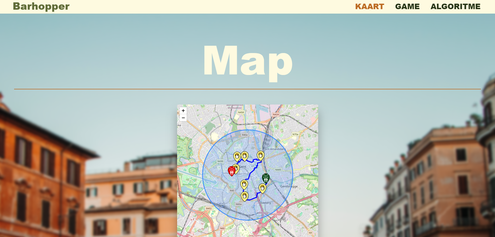
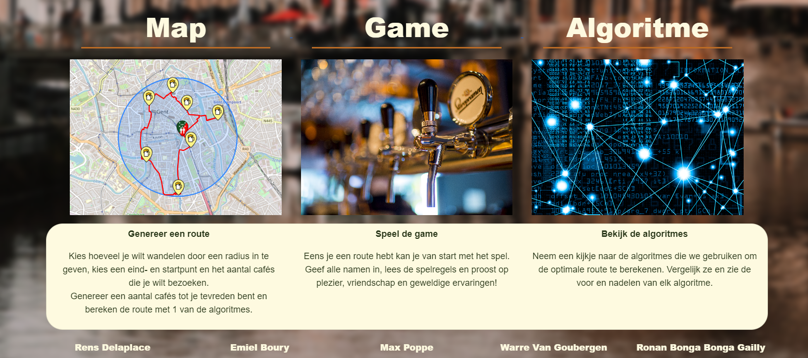

Pubgolf Game Website
This website was created as a part of a school project with a team of 5 people. The main concept behind the project is to generate a route comprising multiple cafes based on a starting and ending point. Users have the option to select from various algorithms to calculate the optimal path. Additionally, the website features a fun game that can be played during the cafe-hopping trip, with each game offering unique rules, making it an enjoyable experience, especially when played with friends.

Through this project, I improved my frontend development skills and gained experience in implementing different algorithms. I also learned how to use APIs to display routes on a map, enhancing the overall user experience. Moreover, this repository includes diagrams that were created prior to the development phase, aiding in project planning and execution.

This project marked my first experience with group collaboration, allowing me to learn valuable lessons in organization and communication within a team setting. Despite encountering challenges along the way, the journey taught me important skills that have been instrumental in my growth as a developer.